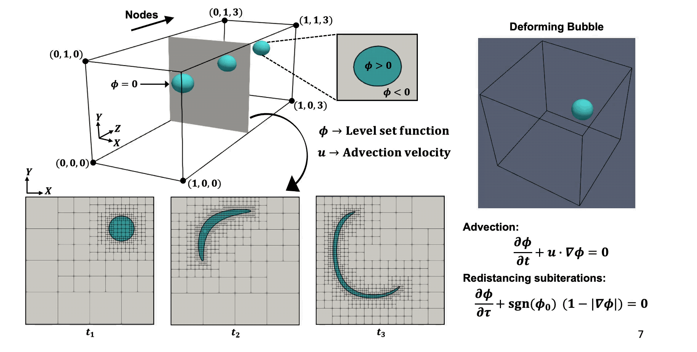

## Execution Environment for Developing AMReX in Bittree Mode

For instructions on how to use the notebook pelase see the README for these repositories:
- https://github.com/Lab-Notebooks/Outflow-Forcing-BubbleML
- https://github.com/akashdhruv/Jobrunner

Data repository is located here:
- https://anl.box.com/s/dzc97mnedg0pdj1ddipu7yl59z4ag30f

## Overview

This execution environment was designed to optimize regrid operation when using AMReX (https://github.com/AMReX-Codes/amrex) in Octree mode. Based on our previous work with Flash-X (https://github.com/AMReX-Codes/amrex) and Paramesh, we found that quering a memory efficient bitmap of block-structured AMR tree to access relevant neighbor information alleviates the need for communication between processes and reduces overhead. The bitmap is managed using the Bittree library (https://github.com/Flash-X/Bittree)

<p align="center">  </p>

Updates to AMReX introduced

## Quickstart

Overview of steps to get this lab notebook running.

1. Install Jobrunner, `pip install pyjobrunner==2023.8 --user`, make sure `~/.local/bin` is in your path.
   
2. Create a new sites folder for you machine see `sites/<site-name>`
 
3. Copy `sites/sedona/environment.sh` and `sites/sedona/Makefile.h` to `sites/<site-name>`.

4. Edit `sites/<site-name>/environment.sh` to set `MPI_HOME` and `HDF5_HOME`. 
   If HDF5 is not installed on your machine do step 7. 

5. Run `configure`:
  ```
  ./configure -s <site-name>
  ```
  This will create `config.sh`


6. Setup software stack:
  ```
  jobrunner setup software/bittree
  jobrunner setup software/amrex
  jobrunner setup software/flashx
  jobrunner setup software/flashkit
  ```

7. If HDF5 is not available on your local machine do:
  ```
  jobrunner setup  software/hdf5
  ```
   
8. Setup a test simulation:
  ```
  jobrunner setup simulation/DeformingBubble/Bittree2D/amrexBittree
  ```

9. Run the simulation
  ```
  jobrunner submit simulation/DeformingBubble/Bittree2D/amrexBittree
  ```
  Console output can be viewed in file `simulation/DeformingBubble/Bittree2D/amrexBittree/job.output`

10. Postprocessing:
   ```
   cd simulation/DeformingBubble/Bittree2D/amrexBittree
   flashkit create xdmf --auto
   ```    
   This will create `INS_Deforming_Bubble.xmf` that can be opened in paraview.

## Performance results
